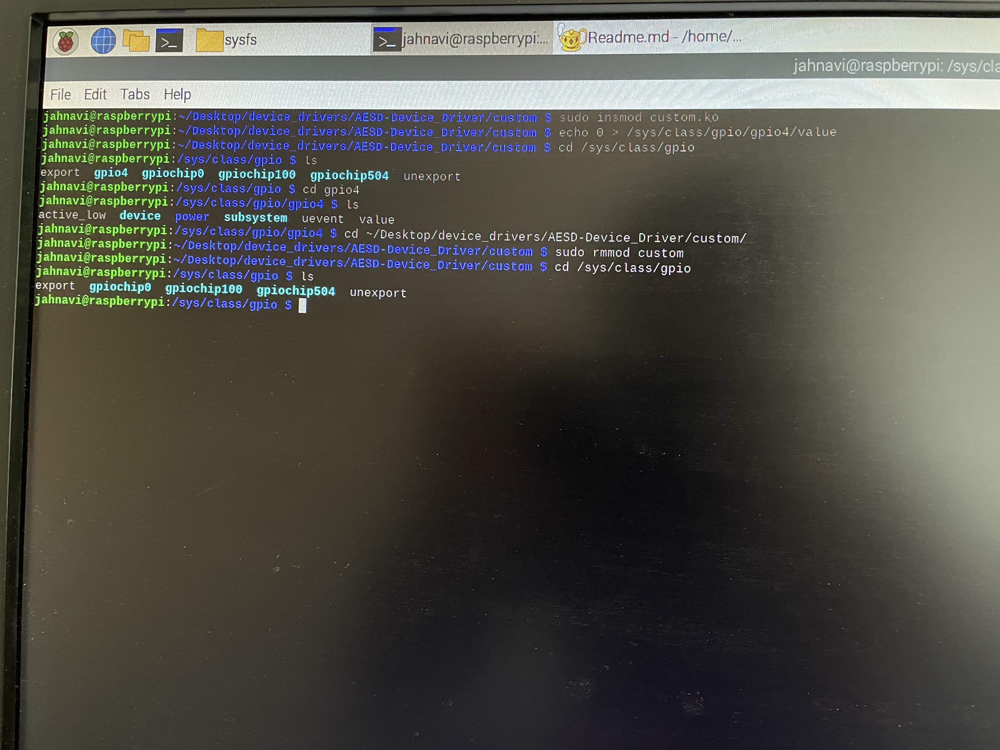
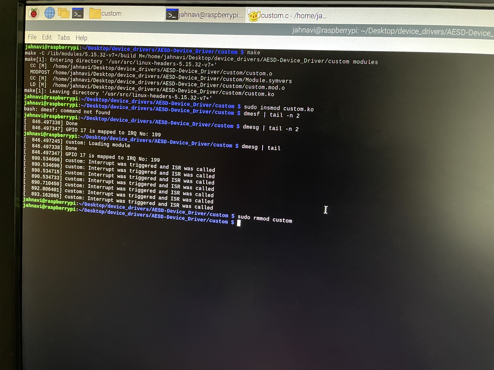

# Instructions to Build and run this module  

1. make  
2. sudo insmod custom.ko  
3. echo 0 > /sys/class/gpio/gpio4/value  
**Output expected:** Since the GPIO is exported to sysfs we can control it by writing to the value file of the gpio in /sys/class/gpio/gpio4.  

 

4. dmesg | tail  
**Output expected:** When a the button connected to GPIO pin 17 is pressed, the LED starts blinks continously with a period of 1 second.  
6. sudo rmmod custom  

