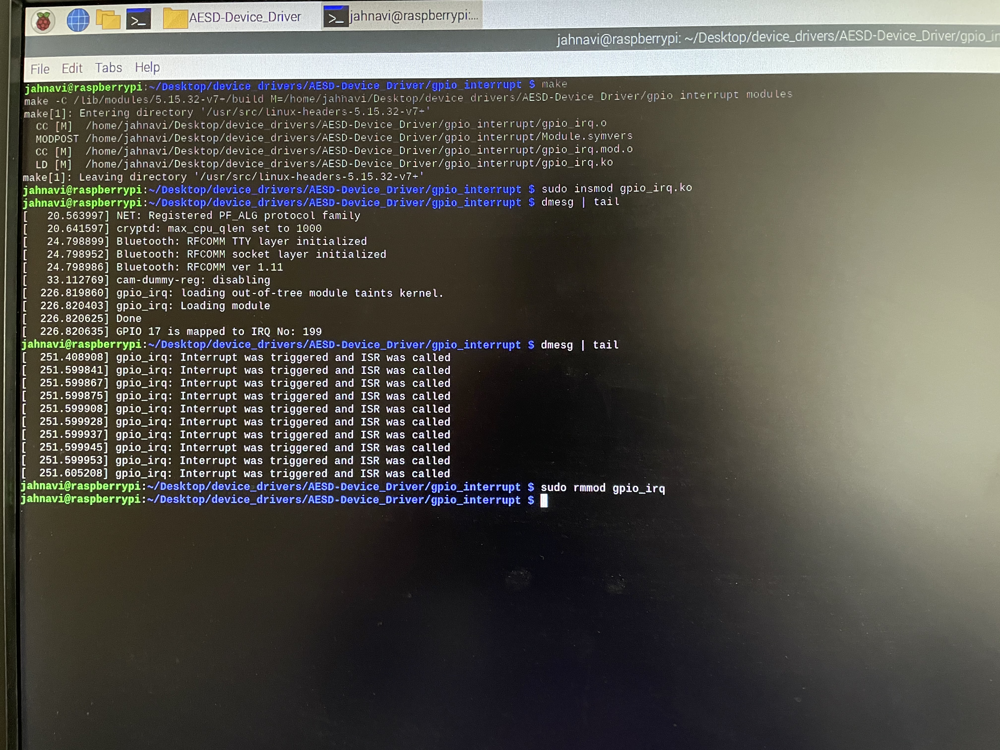

#Instructions to Build and run this module

1. make  
2. sudo insmod gpio_irq.ko  
3. dmesg | tail  
**Output expected:**When the GPIO pin 17 is connected to a button and pressed, we observe that the interrupt is trigerred. This can be seen in the dmesg output.  
4. sudo rmmod gpio_irq  

