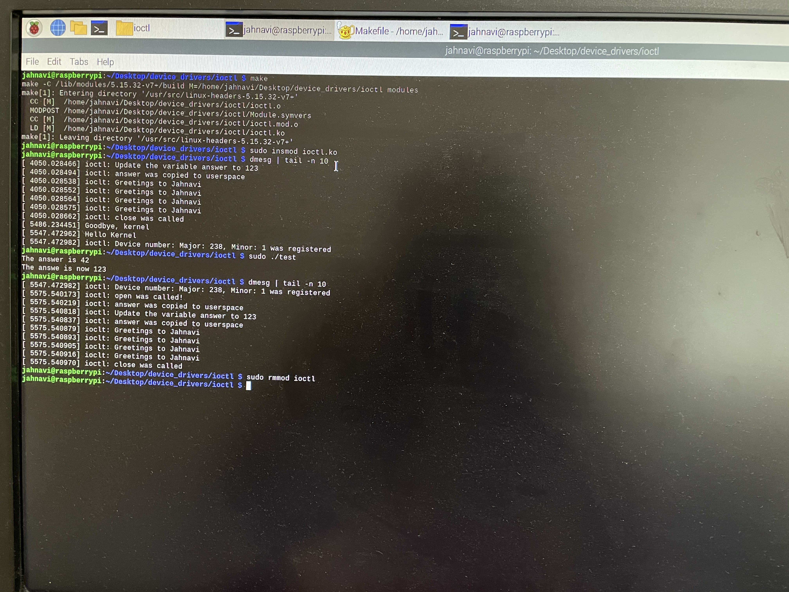

#Instructions to Build and run this module

In one terminal  
gcc test.c -o test  

In another terminal  
1. make  
2. sudo insmod ioctl.ko   
3. dmesg | tail  -n 10  
4. sudo ./test  
5. dmesg | tail -n 10  
**Output expected:** Once we run the test script we observe that we are able to read and write a 32 bit value from and to the driver respectively. The value 42 is read from the device and value 123 is written to the device.
  In the output of dmesg we also observe that Greetings are pritned 4 times since the test script had the repeat value as four.  
6. sudo rmmod ioctl  

