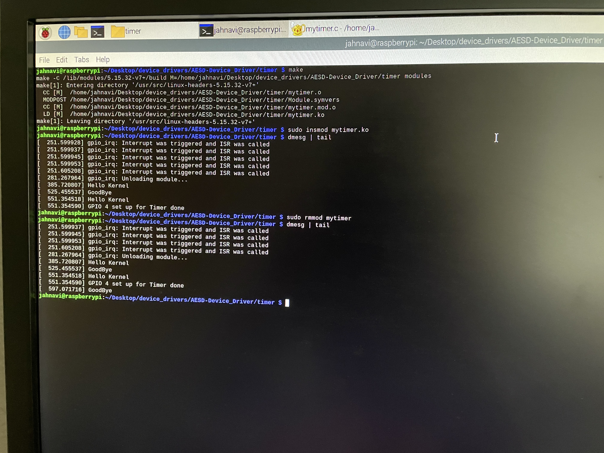

#Instructions to Build and run this module

1. make  
2. sudo insmod mytimer.ko  
3. dmesg | tail  
**Output expected:** Once the module is loaded we observe that an LED connected to the GPIO Pin 4 starts to blink continously at a period of one second.  
4. sudo rmmod timer  

